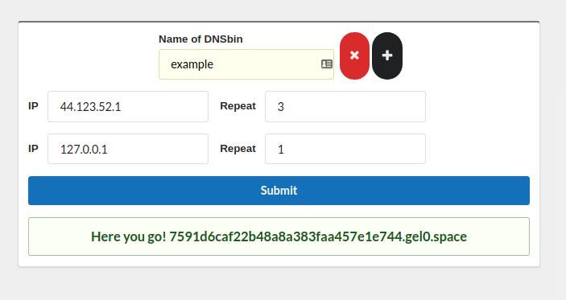
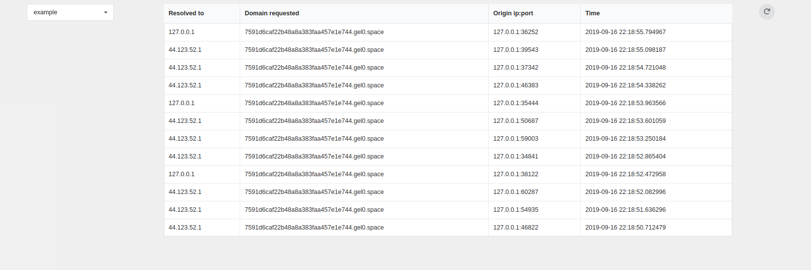

# DnsFookup v 1.0
[DNS Rebinding](https://en.wikipedia.org/wiki/DNS_rebinding) freamwork containing:
 - a dns server obviously
 - web api to create new subdomains and control the dns server, view logs, stuff like that
 - shitty react app to make it even more comfy


## What does it do?
It lets you create dns bins like a burp collaborator
but it adds a bit more features... (at least it tries to)

You can specify what domains should it resolve to and how many times

Then you can see where it was requested from, what did it resolve to,... in logs


## How to run it
```
#Set up postgres and redis
sudo docker-compose up

#in ./BE
pip3 install -r requirements.txt

python3 dns.py # to start the dns server

# for testing purposes development server is enough I think
FLASK_APP=app.py
FLASK_ENV=development
flask run

# then in ./FE
npm install
npm start
```

I feel pretty tired, I'll add more documentation in next commit :D

## TODO

FE - create new token form
FE - show error messages on screen
FE - in /mybins add a brief overview of selected bin
API - shorten long uuid domains? - uuid4().hex DONE
DNS SERVER except - if invalid IP is supplied dont crash - DONE
FE+BE - pagination on logs
